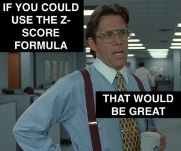

# Scraping, Stats and Plots!!!! Assessment for Mod 2

-----

# Objectives
YW
* scrape a website for relevant information, store that information to a dataframe and save that dataframe as a csv file
* load in a dataframe and do the following
    * calculate the zscores of a given column
    * calculate the zscores of a point from a given column in the dataframe
    * calculate and plot the pmf and cdf of another column
* Level Up
    * find zscores of a certain amount
    * calculate skewness and kurtosis
    * plot pdfs and cdfs
    * calculate probabilities on a normal distribution
    * compare probabilities between 2 normal distributions
    

# Instructions
* Complete the assessment.ipynb notebook
    * part 1 - webscraping
    * part 2 - load in a csv file and calculate the zscores of columns 
    * part 3 - plot subplots of columns and their zscores
    * part 4 - plot the PMF of a column
    * part 5 - plot the CDF of that same column
* run the last cell to convert your notebook to a README.md

# Best of Luck!!!!!!